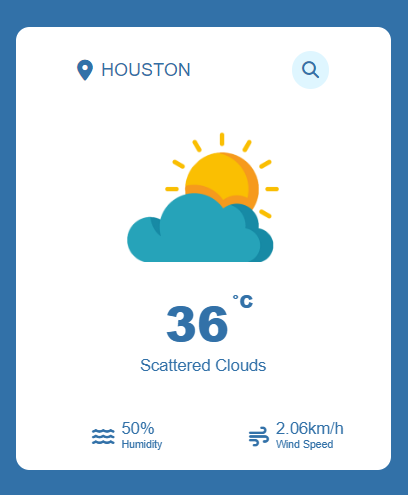

# Weather App  ☀️

## Overview

The Weather App is a simple and user-friendly web application that allows users to check the weather for any location. By providing the name of a city or town, users can access real-time weather information, including temperature, humidity, wind speed, and more. This app is built to be efficient, responsive, and intuitive, making it a go-to choice for checking weather updates on the go.

## Features

- **Weather Information**: Get the current weather conditions for a specific location.
- **Location Search**: Enter the name of any city or town to view its weather details.
- **Responsive Design**: The app is designed to work flawlessly on various devices, including desktops, tablets, and smartphones.
- **User-friendly Interface**: The user interface is intuitive and easy to navigate.
- **Real-time Data**: Weather data is updated in real-time to provide the latest information.

  

  

  
## How to Use

1. **Open the App**: Visit the website hosting the Weather App.
2. **Enter Location**: On the main page, you will find a search bar. Type the name of the location for which you want to check the weather.
3. **Get Weather Details**: Click on the "Search" button or press the "Enter" key, and the app will display the weather information for the specified location.
4. **View Weather Information**: The weather details will include temperature, humidity, wind speed, and other relevant data.
5. **Search Again**: To check the weather for another location, simply type the new location into the search bar and repeat the process.

## Technologies Used

The Weather App is developed using the following technologies:

- **Front-end**: HTML5, CSS, JavaScript
- **Weather API**: [Weather API](https://www.openweathermap.org)

## Development

If you are interested in contributing to the development of the Weather App or running it locally for testing purposes, follow these steps:

1. Clone the repository: `git clone [repository_url]`
2. Navigate to the project directory: `cd weather-app`
3. Open the `index.html` file in your web browser.

## API Usage

The Weather App utilizes a weather API to fetch weather data for different locations. As of now, the API used is `openweathermap.org`. If you plan to deploy this app or make changes that depend on weather data, you will need to sign up for an API key from the weather service provider.

## License

The Weather App is released under the [MIT] License. For more details, please refer to the `LICENSE` file in this repository.

## Contribution Guidelines

Contributions to the Weather App are welcome! If you find any issues or have suggestions for improvements, please submit a pull request or create an issue in this repository. Please follow the standard coding conventions and ensure that your code is well-documented.

## Contact

If you have any questions, suggestions, or feedback, feel free to contact me at [chiedozie.ehileme@gmail.com].

Thank you for using the Weather App! We hope it helps you stay prepared and informed about the weather conditions in your desired locations.
